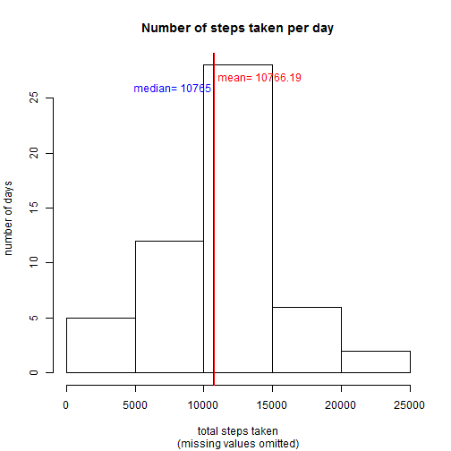
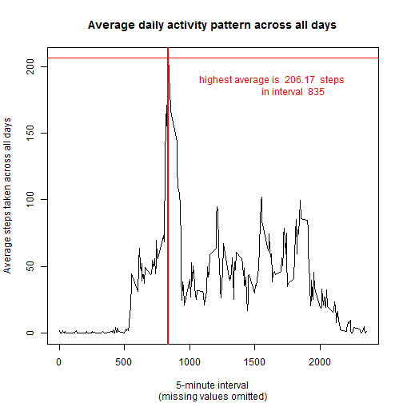
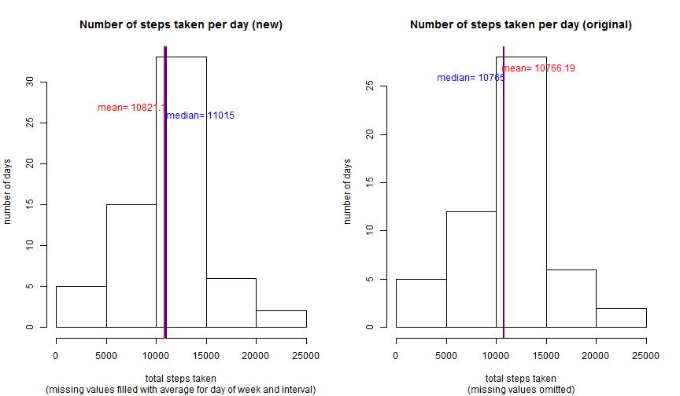
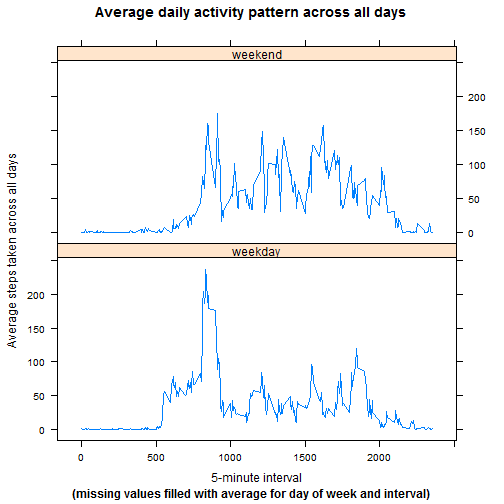

Patterns in data from a personal activity monitoring device
========================================================


------
Class:      [Coursera - Reproducible Research](https://class.coursera.org/repdata-002)  
Assignment: Programming Assignment 1  
Student:    [Jeanne-Anne Jensen](jana.jensen@comcast.net)  

------

## Introduction

In this exercise, we explore data collected via a personal activity montior worn
by an anonymous subject during the months of October and November, 2012.

The data reports the number of steps taken in 5 minute intervals each day.
(Interval 0 is the time from midnight through 4 mintues past, interval 810 is
from 8:10 am through 8:14 am, etc., finishing up with interval 2355 from 11:55pm
through 11:59.)

We will look at distribution of total steps taken in a day as well as average
daily patterns and differences between weekends and weekdays. We will also look
at the bias effect of missing values and how the pattern changes with a simple
algorithm for filling them.

------

## Data

Dataset: [Activity monitoring data](https://d396qusza40orc.cloudfront.net/repdata%2Fdata%2Factivity.zip) [52K]

The variables included in this dataset are:
* steps: Number of steps taking in a 5-minute interval (missing values are coded
as NA)
* date: The date on which the measurement was taken in YYYY-MM-DD format
* interval: Identifier for the 5-minute interval in which measurement was taken

The dataset consists of 17,568 observations stored in a comma-separated-value
(CSV) file.

------

## Exploring the data

### Loading and preprocessing the data

Set the environment, get data, and take a look at what we got: 


```r
# prep environment
library(plyr)      # ddply, summarise, join
library(lattice)   # xyplot
setwd("~/GitHub/RepData_PeerAssessment1")

# get and load data
fileUrl <- "https://d396qusza40orc.cloudfront.net/repdata%2Fdata%2Factivity.zip"
zipfile <- "activity.zip"
if(!file.exists(zipfile)){download.file(fileUrl,destfile=zipfile)}
unzip(zipfile, list=FALSE)
textfile <- unzip(zipfile,files=NULL,list=TRUE)[1,"Name"] # let zip provide name
fullData <- read.csv(textfile)

# take a look at what we've got
str(fullData)
```

```
## 'data.frame':	17568 obs. of  3 variables:
##  $ steps   : int  NA NA NA NA NA NA NA NA NA NA ...
##  $ date    : Factor w/ 61 levels "2012-10-01","2012-10-02",..: 1 1 1 1 1 1 1 1 1 1 ...
##  $ interval: int  0 5 10 15 20 25 30 35 40 45 ...
```

```r
summary(fullData)
```

```
##      steps               date          interval   
##  Min.   :  0.0   2012-10-01:  288   Min.   :   0  
##  1st Qu.:  0.0   2012-10-02:  288   1st Qu.: 589  
##  Median :  0.0   2012-10-03:  288   Median :1178  
##  Mean   : 37.4   2012-10-04:  288   Mean   :1178  
##  3rd Qu.: 12.0   2012-10-05:  288   3rd Qu.:1766  
##  Max.   :806.0   2012-10-06:  288   Max.   :2355  
##  NA's   :2304    (Other)   :15840
```


So we have:
* steps are a continuous integer variable ranging from
0 to
806 with a median of
0 (i.e. most intervals
have no activity) and 2304 missing values
* date is a factor with 61
values ranging from "2012-10-01" to "2012-11-30"
* interval is a discrete variable with 288
values from 0 to 2355

All as expected from the description provided. Now we can look at what the data
tell us.

### What is mean total number of steps taken per day?

To explore this question, we need to aggregate the data to the date level.


```r
# aggregate the data and calculate values of interest
dayData <- ddply(fullData[which(fullData$steps>=0),],  # non-missing values
                 "date", # aggregation field
                 summarise,
                 total=sum(steps))
dayMean   <- round(mean(dayData$total),2)
dayMedian <- round(median(dayData$total),2)

# plot the distribution
hist(dayData$total,
     main="Number of steps taken per day",
     sub="(missing values omitted)",
     xlab="total steps taken", ylab="number of days")
abline(v=dayMedian,lwd=2,col="blue")
text(dayMedian-3000, 26, labels=paste("median=",dayMedian), col="blue")
abline(v=dayMean,lwd=1, col="red")
text(dayMean+3300, 27, labels=paste("mean=",dayMean), col="red")
```

 


We can see the mean and median are almost identical if we disregard the missing
values.

### What is the average daily activity pattern?

A more interesting question, to see the pattern of activity for an "average"
day, we need to aggregate the data to the interval level.


```r
# aggregate the data and calculate values of interest
intervalData <- ddply(fullData[which(fullData$steps>=0),],  # non-missing values
                      "interval", # aggregation field
                      summarise,
                      avgSteps=round(mean(steps),2))
intervalMax <- max(intervalData$avgSteps)
maxInterval <- intervalData[intervalData$avgSteps==intervalMax,"interval"]

# plot the distribution
with(intervalData,plot(interval,avgSteps,
                       type='l',
                       main="Average daily activity pattern across all days",
                       sub="(missing values omitted)",
                       xlab='5-minute interval',
                       ylab='Average steps taken across all days'))
abline(v=maxInterval,lwd=2,col="red")
abline(h=intervalMax,col="red")
text(maxInterval+800,intervalMax-20,col="red",
     labels=paste("highest average is ",intervalMax," steps
                  in interval ",maxInterval))
```

 


Overall, our subject walks more in the morning and is moderately active
throughout the day, again disregarding missing values.

### Imputing missing values

As noted above, there are a number of days/intervals where there are
missing values. The presence of missing days may introduce bias into
some calculations or summaries of the data.

#### 1. How many missing values?

```r
paste(sum(is.na(fullData$steps))," out of ",nrow(fullData),
      " rows have missing step counts")
```

```
## [1] "2304  out of  17568  rows have missing step counts"
```


#### 2. What might be a reasonable way to fill them in?
Many people have an overall weekly pattern to their activity. We can fill
in the missing values with the mean for that interval across that day of
week.

#### 3. Create a filled-in dataset

```r
fullData$dow <- as.factor(strftime(fullData$date,'%a')) # add DOW for means
impute.mean <- function(x) replace(x, is.na(x), round(mean(x, na.rm = TRUE),0))
filledData <- ddply(fullData, .(interval,dow),
                    transform,
                    steps = impute.mean(steps))
```


#### 4. How does the distribution differ with the imputed means?

```r
# same aggregation as before, but with the new data
dayData2 <- ddply(filledData,  # missing values filled in
                  "date", # aggregation field
                  summarise,
                  total=sum(steps))
dayMean2   <- round(mean(dayData2$total),2)
dayMedian2 <- round(median(dayData2$total),2)

# same plot as before, but with the new data and the old one side-by-side
par(mfrow = c(1,2))  # two plots, side-by-side
# new plot
hist(dayData2$total,
     main="Number of steps taken per day (new)",
     sub="(missing values filled with average for day of week and interval)",
     xlab="total steps taken", ylab="number of days")
abline(v=dayMedian2,lwd=2,col="blue")
text(dayMedian2+3500, 26, labels=paste("median=",dayMedian2), col="blue")
abline(v=dayMean2,lwd=2, col="red")
text(dayMean2-3200, 27, labels=paste("mean=",dayMean2), col="red")
# old plot repeated
hist(dayData$total,
     main="Number of steps taken per day (original)",
     sub="(missing values omitted)",
     xlab="total steps taken", ylab="number of days")
abline(v=dayMedian,lwd=2,col="blue")
text(dayMedian-3200, 26, labels=paste("median=",dayMedian), col="blue")
abline(v=dayMean,lwd=1, col="red")
text(dayMean+3500, 27, labels=paste("mean=",dayMean), col="red")
```

 


They are not the same, but any bias in this view from missing values doesn't
appear to be very significant. 

### Are there differences in activity patterns between weekdays and weekends?

Many people have different patterns during the work day than on weekends.

#### 1. Identify "weekend" versus "weekday"


```r
filledData$wkp <- as.factor(ifelse(filledData$dow=="Sat"|filledData$dow=="Sun","weekend","weekday"))
intervalData2 <- ddply(filledData,
                      .(interval,wkp), # aggregation fields
                      summarise,
                      avgSteps=round(mean(steps),2))
intervalMax3 <- max(intervalData2$avgSteps)
maxInterval3 <- intervalData2[intervalData2$avgSteps==intervalMax3,"interval"]
```


#### 2. Compare the two time series

```r
with(intervalData2,xyplot(avgSteps ~ interval | wkp,
                          type='l',
                          layout=c(1,2),
                          main="Average daily activity pattern across all days",
                          xlab='5-minute interval',
                          ylab='Average steps taken across all days',
                          sub="(missing values filled with average for day of week and interval)"))
```

 


We see a clear pattern of morning, noon, mid-afternoon, and early evening spikes
during the week whereas weekend activity appears more uniformly distributed.
Because there are more weekdays, the weekday pattern dominates the overall
"average" day metrics.

### Clean up memory and disk

```r
unlink(textfile)
rm(fullData,filledData,
   dayData,dayMean,dayMedian,
   dayData2,dayMean2,dayMedian2,
   intervalData,intervalMax,maxInterval,
   intervalData2,
   fileUrl,textfile,zipfile,
   impute.mean)
```


## Conclusion

We looked at distribution of total steps taken in a day and found that most
days had more than 10,000 steps. We looked for bias in these calculations from
missing values and didn't find any. And we saw the different time series
patterns between weekends and weekdays, where weekdays are much spikier than
weekends.
